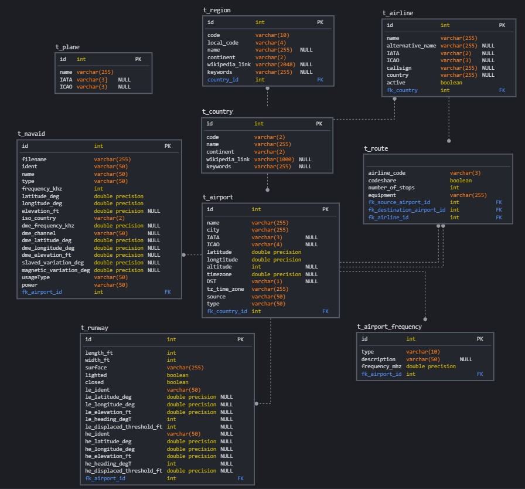
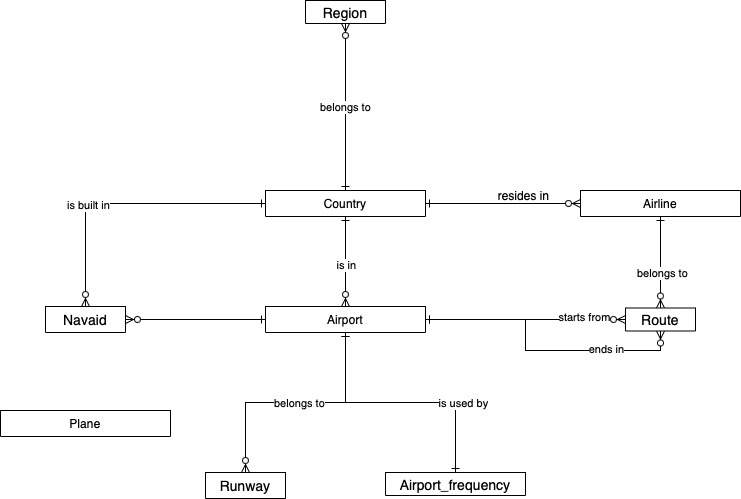
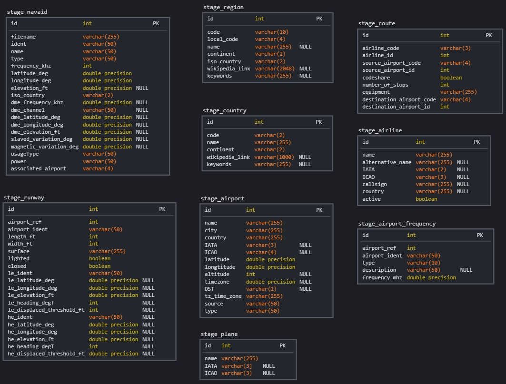

# Data analysis, Entity and DB model design

The data for this semestral work is an [Airlines dataset](https://openflights.org/data.html). These data were given to us in the task description.

Výstup:
textový popis zdrojových dat - tzn. detailní popis jednotlivých atributů včetně datových typů, business názvů a business popisu dat
entitní model targetu
DB model stage a targetu v CASE nástroji

## Textual description of the source data

The detailed description of any attribute also with data types are in [this Google sheet](https://docs.google.com/spreadsheets/d/1zwOfF1kJ0ueje3LrCszSYIMzswWb4AQETSTEIrDHxkc/edit#gid=0). In file `detectedDataTypes.txt` there is even detailed description of the data types for Postgres database, which was generated using python script `data_types.py`.

The business description of the attributes are in the google sheet above.

- *countries*: Data about countries, where any airline is operating
- *airlines*: An airline is an company, which operates flights on specified routes.
- *airports*: Each airport contains several runways. An Airport is located in a country.
- *planes*: Data about planes
- *regions*: Region is a part of a country
- *routes*: designed route from one to another airport
- *airport_frequencies*: defining which airport uses which frequency
- *runways*: defines measures and directions of a runway
- *navaids*: navigational aid for an airpot [about navaid](https://www.systemsinterface.com/products/navaids/)

## Entity model of the target

Desribed in `schema_target.jpg` file.

## Stage DB model

The conceptual diagram model of the database is [this draw.io sheet](https://app.diagrams.net/#G1uEQc7dckwIgR0fNPFiHfLhqho4kzgPvD), also printed in `schema_concept.jpg` file.

Stage DB model is desribed in `schema_stage.jpg` file.

