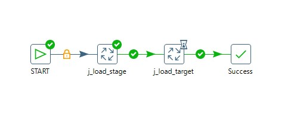
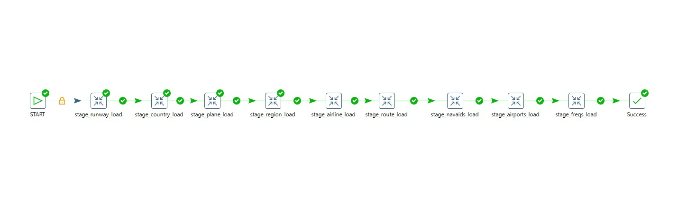
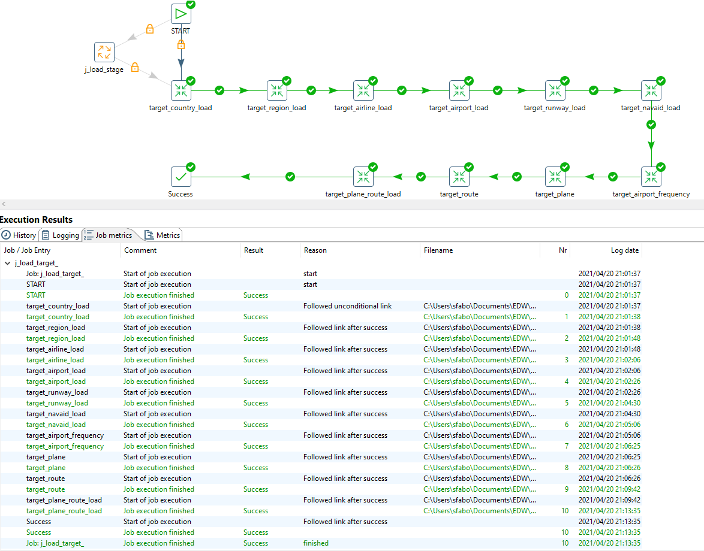

# DLM, ETL

## Výstup

- datová logická mapa integrovaných dat - názvy atributů v source systému, názvy atributů v target DB, typ historizace apod.

The map is available in [this Google sheet](https://docs.google.com/spreadsheets/d/1zwOfF1kJ0ueje3LrCszSYIMzswWb4AQETSTEIrDHxkc/edit?usp=sharing)

- upravené DDL s technickými sloupci a správnými klíči

DDL files to create Stage and Target databases are located in folder db. We are using Postgresql database running in docker container configured in `docker_compose.yaml`. After running `docker-compose up` the container runs scripts in folder db and initializes the database.

- ETL procesy pro stage i target (ukázka historizace všech typů) - jeden job, který bude spouštět ostatní transformace, které nahrávají jednotlivé tabulky (co transformace, to tabulka, transformace se nacházejí v transakci)

All transformations are located in folder transformations. Screenshots from Pentaho are in folder images.

## How to run this?

If you have enough memory, start docker, run `docker-compose up`, which will create postgres database on localhost, port `5432` and will run all three scripts from `db` directory in alphabetical order:

- init script (for new user named `pentaho`, password is in `docker-compose.yaml`)
- create script for stage DB
- create script for target DB

If you still did not get rid of your 2gb ram and Core 2 Duo *Lover*, you can do it oldschool:

- start your postgres db on localhost
- run all sql create scripts in `db` directory in alphabetical order

After all this, go to `transformations` dir and after opening Pentaho Data Integration, version 6.

**Do not forget** to edit your environment variables in PDI Kettle, namely `InputFolder` containing all the data and `TransformationsFolder` containing all the transformations (prereq of the jobs only). Example provided in `.env-pentaho`

In this friendly application run:

- `j_load_stage.kjb`
- `j_load_target.kjb`

To run both stage and target jobs run:
- `j_load_full.kjb`

or go and play around with each transformation.

## Notes

- Stage load time:    ~1min
- Target load time:   ~12min

- Almost all data are historized using SCD1, instead of planes. There are more updates on planes data from 2018-2019, so we decided to use SCD2 historization to see the changes in time.
- Unfortunately we did not come up with anything more robust than running first `stage_plane_load.ktr` and then `t_plane_load.ktr` with different filepath in *CSV file input* pentaho component.
- There is one M:N relation between planes and routes, named `t_plane_route` in target database.
  - Since there are some planes missing in the route.equipment attribute, we just think of them as already outdated, and do not keep them in this table (in other words, we filter out null values after doing database lookup).
- "Make the transformation database transactional" may not be checked in all transformations. However, it works as it should.

To at least empirically prove, that this part of semestral works, here are screenshots of both stage and target jobs:

