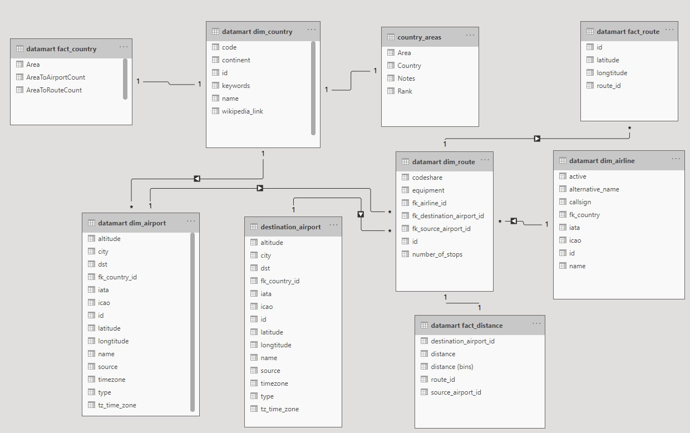
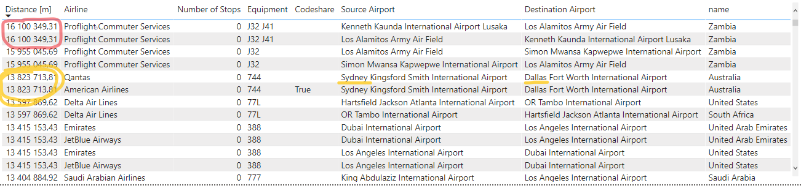
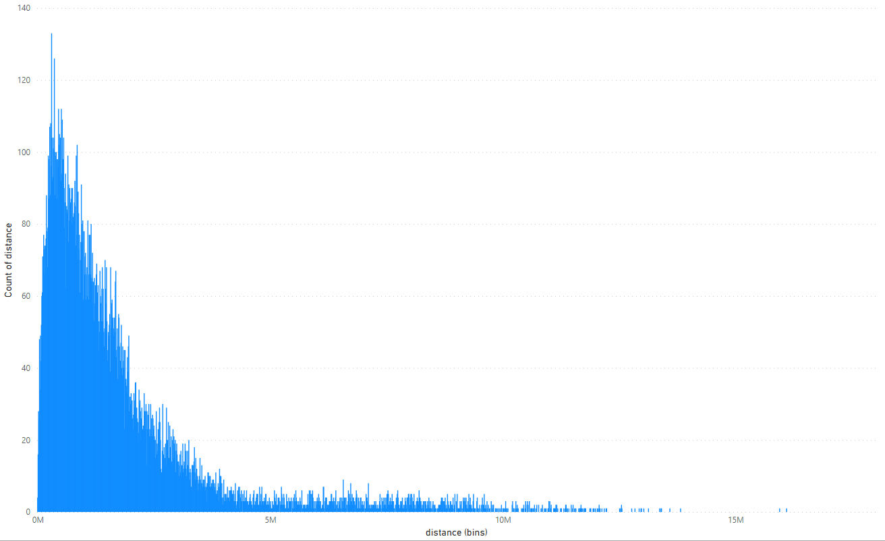
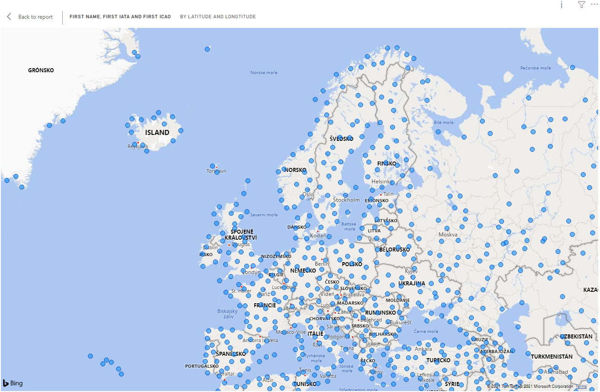
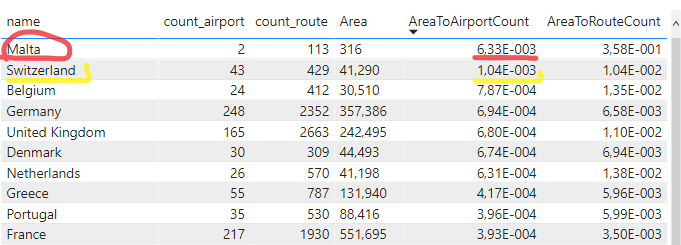

# Datamart + dashboard

## Výstup:
- model datamartu v CASE nástroji
- DDL datamartu
- business popis navrženého datamartu - obsažené atributy, smysl datamartu
- dashboard v Power BI ve formátu .pbix
- písemné zodpovězení libovolných 2 ze 3 zadaných otázek pomocí dashboardu
- demonstrace výstupů v dashboardu pomocí videa (není potřeba nějak natáčet sebe, stačí pouze smysluplně klikat a komentovat dashboard vč. zobrazených výsledků)

## Otázky

1. Mezi jakými letišti se létají nejdelší lety? HINT: Analyzujte interaktivní formou - včetně detailu o jednotlivých nejdelších letech.
2. Jaké země v Evropě má nejhustší síť letišť? Zkuste porovnat i s počtem letových tras, jestli tyto dva aspekty spolu korelují. HINT: Pro výpočet poměru můžete využít externí zdroje s rozlohou jednotlivých evropských států, např. https://en.wikipedia.org/wiki/List_of_European_countries_by_area.
3. not answering: ~~Je důležitá pro výběr výrobce letadel země, ve které se aerolinka nachází? HINT: Zkuste analyzovat případy, kdy v Americe mají aerolinky flotilu tvořenou evropskými letadly (např. Airbus) a naopak v Evropě, kdy aerolinky používají výhradně Boeing. V případě Ruska zkoumejte zastoupení západních letadel (Boeing, Airbus) v porovnání s ruskými letadly (Ilyushin, Tupolev, Antonov). Následnou analýzu vyhodnoťte a odpovězte na zadanou otázku.~~

## Datamart

To run the docker container and Pentaho transformations see `02`.

### DDL

The DDL to create datamart `create_datamart.sql` was added to the db folder to be inicialized by docker-compose.
Database role analytics and user `powerbi` with password `niedw` is created. The user has **CONNECT** and **SELECT** permissions on schema `datamart`.

To create datamart views, simply run all the transformations from `02` and they will be lazily created (if not, connect to the postgres database and run the script again).

### fact_country

Number of airports and routes in each country. Computed using `count(distinct x)`

### fact_distance

The coordinations of *source* and *destination* airports are used to calculate distance between them. To compute the distance we use the `earth_distance` function from installed extension `earthdistance`.

### fact_route

This fact table is the source for visualization of routes on world map. To create the visualization we need the latitude and longtitude of airport and also a point in time to be able to draw the line from source to destination airport. Source airports have time = 1 and destination airports have time = 2.

### Model

Model of the datamart:

### Business description

Attributes in datamart database tables are described [in this Google Doc](https://docs.google.com/spreadsheets/d/1zwOfF1kJ0ueje3LrCszSYIMzswWb4AQETSTEIrDHxkc/edit#gid=2099248517) 

## PowerBI Dashboard

The Dashboard (`airlines_report.pbix`) uses the datamart to visualize airlines data. Additionally it parses html table from Web source https://en.wikipedia.org/wiki/List_of_European_countries_by_area to get areas of European countries. The areas are saved in table `country_areas`

### PowerBI Data Model

The report contains 3 dashboards:
1. Route distances - shows longest routes in dataset and length distribution
2. Europe airports - shows map of European airports and compares the counts of airports and routes to the area of given country
3. Routes - visualizes the routes of active airlines on world map

## Main Questions and Answeres

### 1. Mezi jakými letišti se létají nejdelší lety?

Below is a table with longest 12 routes:

After ordering fact_distance table by distance, we get Zambia <-> Los Angeles operated by Proflight Commuter Services.
This route is equipped by British Aerospace Jetstream 32 and 41. These two planes have range of 1 200 / 1 433 km respectively ([source](https://en.wikipedia.org/wiki/British_Aerospace_Jetstream)), which is definitely less than 16 100 km - route length. This must be some kind of mistake in the data.

Ignoring this might-be-mistake route we find a second longest route from Sydney to Dallas of length 13 824 km equipped with Boeing 747. This plane (type 747-400ER) has a range of 14 045 km (with max. payload and takeoff weight) ([source](https://en.wikipedia.org/wiki/Boeing_747)), which can make this route. 

Assuming first route is a mistake, second one (Sydney - Dallas) is a winner.

Below is a histogram of route distances:

This histogram graph was created with size of bin: 10km.
Here we can see, that most of the routes are pretty short, ranging from approx. 250km to 1500km.

### 2. Jaké země v Evropě má nejhustší síť letišť? Zkuste porovnat i s počtem letových tras, jestli tyto dva aspekty spolu korelují.

In the map below we can see approximately how many airports there are in europe.

First of all, we need to select web source - wikipedia - to fill the area field the fact table of airports. Then we will link these numbers to countries, where the airports are, filter out non-european countries and there we have the winner:

Above is a table of countries in Europe, ordered by *number of airports to area ratio*. Top 10 are shown.

The first entry - Malta is a small islands beneath Sicily with area of only 316km^2. Since it has 2 airports, it makes it the country with the most dense network of airports per country.

Taking in mind number of routes per country ratio, we can see how nicely these two fields correlate. The correlation is 0.86, which is very close to 1 (meaning perfect linear correlation).
It makes sense - higher the number of airports per country, higher the number of routes beginning/finishing in the country.

## Video demonstration

There is a directory `video` in this repository, where are demonstration videos in mp4 format of two answered questions.

