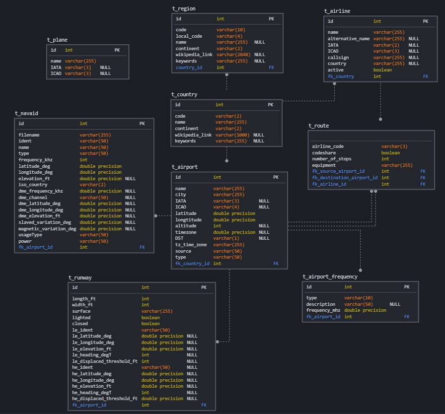
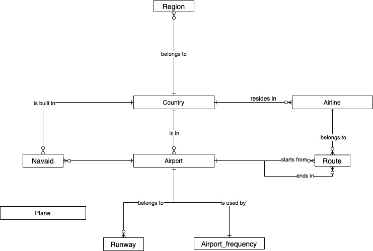
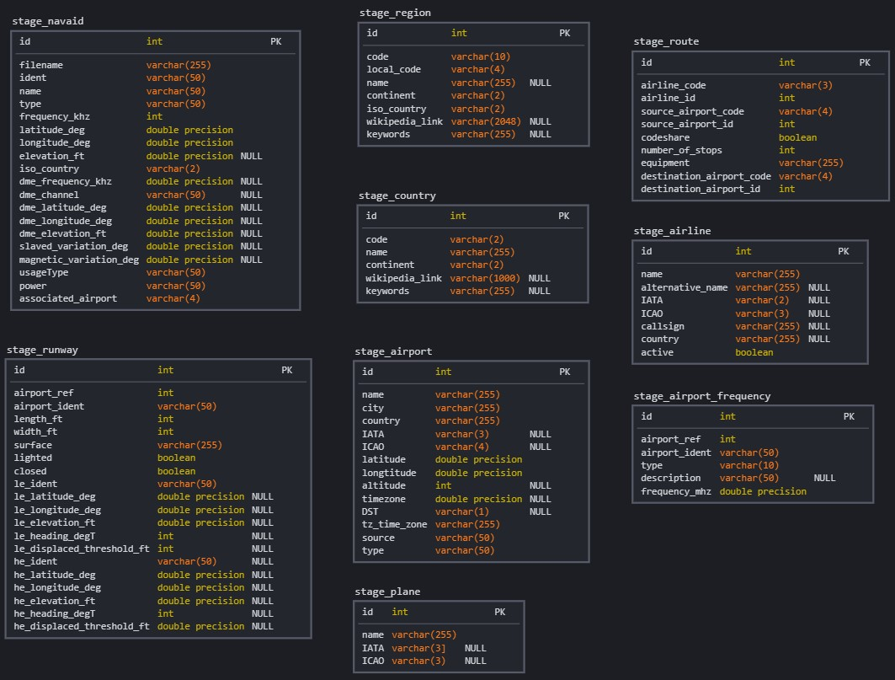
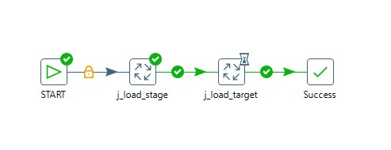
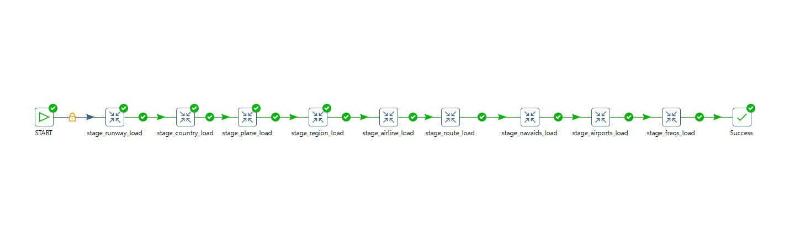
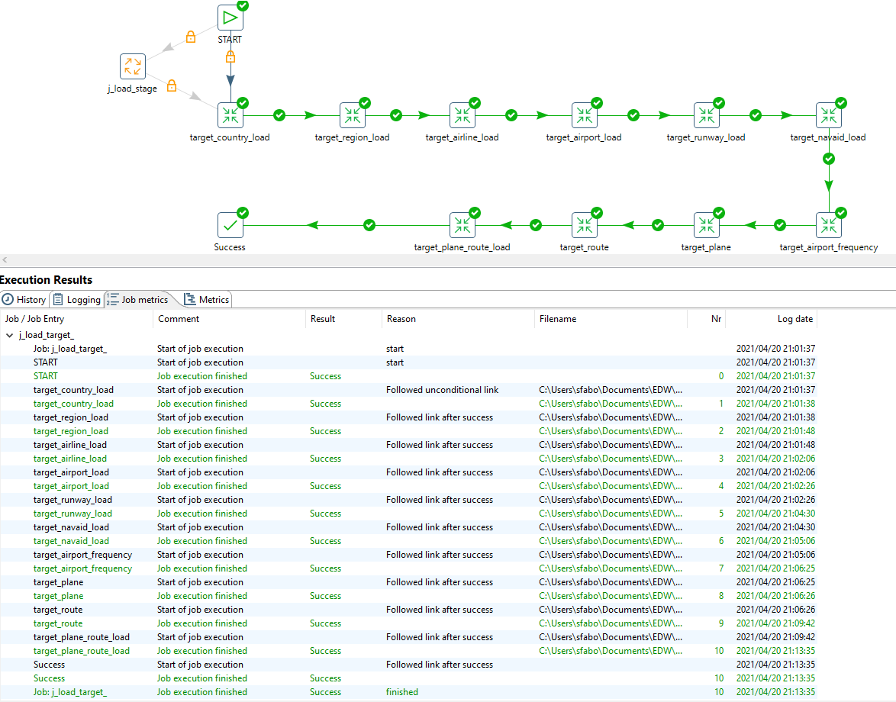
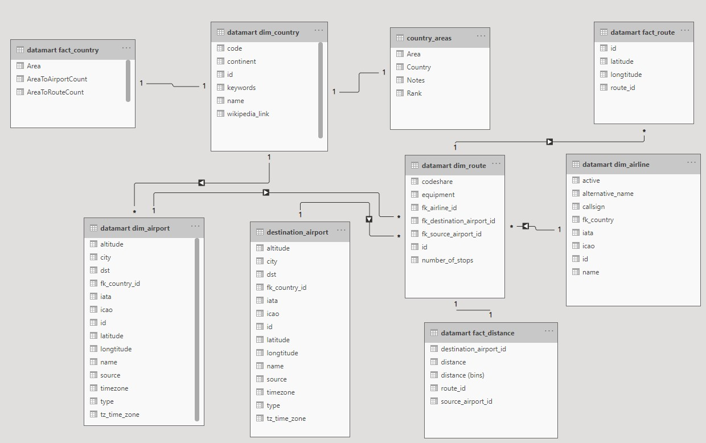
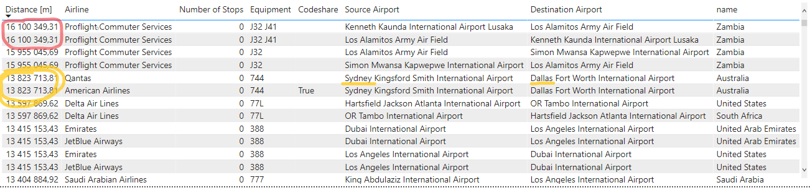
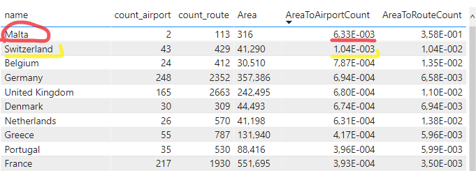

# NI-EDW Semestral work 2021 - Airlines

This project was implemented as semestral work for class Enterprise Data Warehouses at Czech Technical University, [Faculty of Information Technology](https://fit.cvut.cz/en).

Authors: [@tousekjan](https://github.com/tousekjan/), [@66Antigravity](https://github.com/66Antigravity/)

# Data analysis, Entity and DB model design

The data for this semestral work is an [Airlines dataset](https://openflights.org/data.html). These data were given to us in the task description.

Output:
Text description of source data - detailed description of all attributes including data types, business names, business description
Entity model of Target database
Database model of Stage and Target in CASE tool

## Textual description of the source data

The detailed description of any attribute also with data types are in [this Google sheet](https://docs.google.com/spreadsheets/d/1zwOfF1kJ0ueje3LrCszSYIMzswWb4AQETSTEIrDHxkc/edit#gid=0). In file `detectedDataTypes.txt` there is even detailed description of the data types for Postgres database, which was generated using python script `data_types.py`.

The business description of the attributes are in the google sheet above.

- *countries*: Data about countries, where any airline is operating
- *airlines*: An airline is an company, which operates flights on specified routes.
- *airports*: Each airport contains several runways. An Airport is located in a country.
- *planes*: Data about planes
- *regions*: Region is a part of a country
- *routes*: designed route from one to another airport
- *airport_frequencies*: defining which airport uses which frequency
- *runways*: defines measures and directions of a runway
- *navaids*: navigational aid for an airpot [about navaid](https://www.systemsinterface.com/products/navaids/)

## Entity model of the target

Desribed in `schema_target.jpg` file.

## Stage DB model

The conceptual diagram model of the database is [this draw.io sheet](https://app.diagrams.net/#G1uEQc7dckwIgR0fNPFiHfLhqho4kzgPvD), also printed in `schema_concept.jpg` file.

Stage DB model is desribed in `schema_stage.jpg` file.

# DLM, ETL

## Výstup

- datová logická mapa integrovaných dat - názvy atributů v source systému, názvy atributů v target DB, typ historizace apod.

The map is available in [this Google sheet](https://docs.google.com/spreadsheets/d/1zwOfF1kJ0ueje3LrCszSYIMzswWb4AQETSTEIrDHxkc/edit?usp=sharing)

- upravené DDL s technickými sloupci a správnými klíči

DDL files to create Stage and Target databases are located in folder db. We are using Postgresql database running in docker container configured in `docker_compose.yaml`. After running `docker-compose up` the container runs scripts in folder db and initializes the database.

- ETL procesy pro stage i target (ukázka historizace všech typů) - jeden job, který bude spouštět ostatní transformace, které nahrávají jednotlivé tabulky (co transformace, to tabulka, transformace se nacházejí v transakci)

All transformations are located in folder transformations. Screenshots from Pentaho are in folder images.

## How to run this?

If you have enough memory, start docker, run `docker-compose up`, which will create postgres database on localhost, port `5432` and will run all three scripts from `db` directory in alphabetical order:

- init script (for new user named `pentaho`, password is in `docker-compose.yaml`)
- create script for stage DB
- create script for target DB

If you still did not get rid of your 2gb ram and Core 2 Duo *Lover*, you can do it oldschool:

- start your postgres db on localhost
- run all sql create scripts in `db` directory in alphabetical order

After all this, go to `transformations` dir and after opening Pentaho Data Integration, version 6.

**Do not forget** to edit your environment variables in PDI Kettle, namely `InputFolder` containing all the data and `TransformationsFolder` containing all the transformations (prereq of the jobs only). Example provided in `.env-pentaho`

In this friendly application run:

- `j_load_stage.kjb`
- `j_load_target.kjb`

To run both stage and target jobs run:
- `j_load_full.kjb`

or go and play around with each transformation.

## Notes

- Stage load time:    ~1min
- Target load time:   ~12min

- Almost all data are historized using SCD1, instead of planes. There are more updates on planes data from 2018-2019, so we decided to use SCD2 historization to see the changes in time.
- Unfortunately we did not come up with anything more robust than running first `stage_plane_load.ktr` and then `t_plane_load.ktr` with different filepath in *CSV file input* pentaho component.
- There is one M:N relation between planes and routes, named `t_plane_route` in target database.
  - Since there are some planes missing in the route.equipment attribute, we just think of them as already outdated, and do not keep them in this table (in other words, we filter out null values after doing database lookup).
- "Make the transformation database transactional" may not be checked in all transformations. However, it works as it should.

To at least empirically prove, that this part of semestral works, here are screenshots of both stage and target jobs:

# Datamart + dashboard

## Výstup:
- model datamartu v CASE nástroji
- DDL datamartu
- business popis navrženého datamartu - obsažené atributy, smysl datamartu
- dashboard v Power BI ve formátu .pbix
- písemné zodpovězení libovolných 2 ze 3 zadaných otázek pomocí dashboardu
- demonstrace výstupů v dashboardu pomocí videa (není potřeba nějak natáčet sebe, stačí pouze smysluplně klikat a komentovat dashboard vč. zobrazených výsledků)

## Otázky

1. Mezi jakými letišti se létají nejdelší lety? HINT: Analyzujte interaktivní formou - včetně detailu o jednotlivých nejdelších letech.
2. Jaké země v Evropě má nejhustší síť letišť? Zkuste porovnat i s počtem letových tras, jestli tyto dva aspekty spolu korelují. HINT: Pro výpočet poměru můžete využít externí zdroje s rozlohou jednotlivých evropských států, např. https://en.wikipedia.org/wiki/List_of_European_countries_by_area.
3. not answering: ~~Je důležitá pro výběr výrobce letadel země, ve které se aerolinka nachází? HINT: Zkuste analyzovat případy, kdy v Americe mají aerolinky flotilu tvořenou evropskými letadly (např. Airbus) a naopak v Evropě, kdy aerolinky používají výhradně Boeing. V případě Ruska zkoumejte zastoupení západních letadel (Boeing, Airbus) v porovnání s ruskými letadly (Ilyushin, Tupolev, Antonov). Následnou analýzu vyhodnoťte a odpovězte na zadanou otázku.~~

## Datamart

To run the docker container and Pentaho transformations see `02`.

### DDL

The DDL to create datamart `create_datamart.sql` was added to the db folder to be inicialized by docker-compose.
Database role analytics and user `powerbi` with password `niedw` is created. The user has **CONNECT** and **SELECT** permissions on schema `datamart`.

To create datamart views, simply run all the transformations from `02` and they will be lazily created (if not, connect to the postgres database and run the script again).

### fact_country

Number of airports and routes in each country. Computed using `count(distinct x)`

### fact_distance

The coordinations of *source* and *destination* airports are used to calculate distance between them. To compute the distance we use the `earth_distance` function from installed extension `earthdistance`.

### fact_route

This fact table is the source for visualization of routes on world map. To create the visualization we need the latitude and longtitude of airport and also a point in time to be able to draw the line from source to destination airport. Source airports have time = 1 and destination airports have time = 2.

### Model

Model of the datamart:

### Business description

Attributes in datamart database tables are described [in this Google Doc](https://docs.google.com/spreadsheets/d/1zwOfF1kJ0ueje3LrCszSYIMzswWb4AQETSTEIrDHxkc/edit#gid=2099248517) 

## PowerBI Dashboard

The Dashboard (`airlines_report.pbix`) uses the datamart to visualize airlines data. Additionally it parses html table from Web source https://en.wikipedia.org/wiki/List_of_European_countries_by_area to get areas of European countries. The areas are saved in table `country_areas`

### PowerBI Data Model

The report contains 3 dashboards:
1. Route distances - shows longest routes in dataset and length distribution
2. Europe airports - shows map of European airports and compares the counts of airports and routes to the area of given country
3. Routes - visualizes the routes of active airlines on world map

## Main Questions and Answeres

### 1. Mezi jakými letišti se létají nejdelší lety?

Below is a table with longest 12 routes:

After ordering fact_distance table by distance, we get Zambia <-> Los Angeles operated by Proflight Commuter Services.
This route is equipped by British Aerospace Jetstream 32 and 41. These two planes have range of 1 200 / 1 433 km respectively ([source](https://en.wikipedia.org/wiki/British_Aerospace_Jetstream)), which is definitely less than 16 100 km - route length. This must be some kind of mistake in the data.

Ignoring this might-be-mistake route we find a second longest route from Sydney to Dallas of length 13 824 km equipped with Boeing 747. This plane (type 747-400ER) has a range of 14 045 km (with max. payload and takeoff weight) ([source](https://en.wikipedia.org/wiki/Boeing_747)), which can make this route. 

Assuming first route is a mistake, second one (Sydney - Dallas) is a winner.

Below is a histogram of route distances:

This histogram graph was created with size of bin: 10km.
Here we can see, that most of the routes are pretty short, ranging from approx. 250km to 1500km.

### 2. Jaké země v Evropě má nejhustší síť letišť? Zkuste porovnat i s počtem letových tras, jestli tyto dva aspekty spolu korelují.

In the map below we can see approximately how many airports there are in europe.

First of all, we need to select web source - wikipedia - to fill the area field the fact table of airports. Then we will link these numbers to countries, where the airports are, filter out non-european countries and there we have the winner:

Above is a table of countries in Europe, ordered by *number of airports to area ratio*. Top 10 are shown.

The first entry - Malta is a small islands beneath Sicily with area of only 316km^2. Since it has 2 airports, it makes it the country with the most dense network of airports per country.

Taking in mind number of routes per country ratio, we can see how nicely these two fields correlate. The correlation is 0.86, which is very close to 1 (meaning perfect linear correlation).
It makes sense - higher the number of airports per country, higher the number of routes beginning/finishing in the country.

## Video demonstration

There is a directory `video` in this repository, where are demonstration videos in mp4 format of two answered questions.
